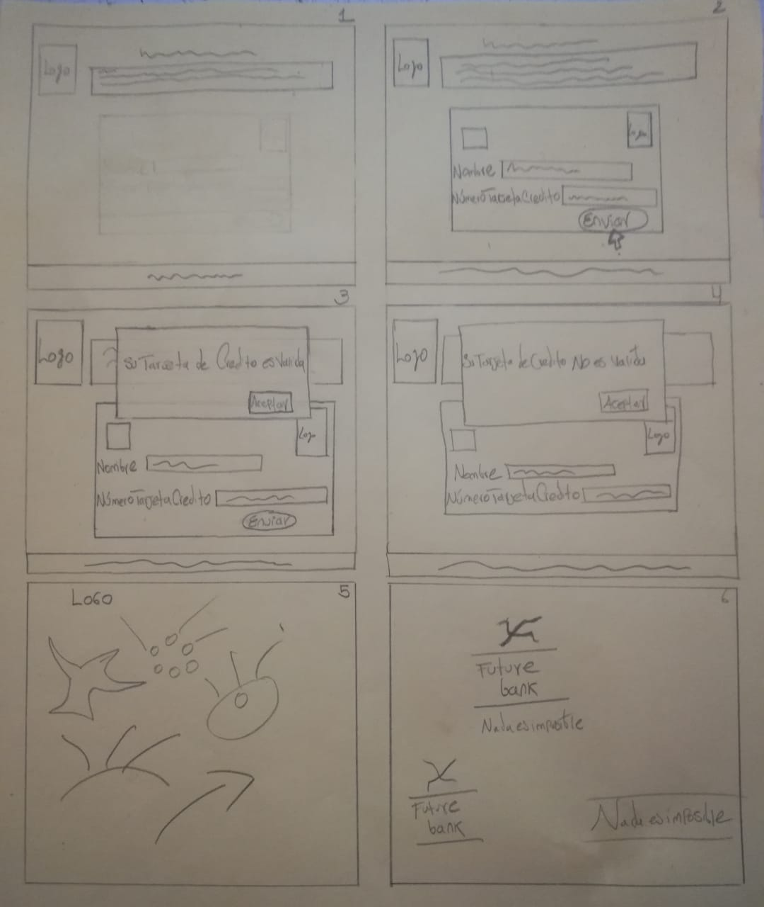

# Tarjeta de crédito válida

                                            FUTURE BANK 
## Índice

* [1. Preámbulo](#1-preámbulo)
* [2. Resumen del proyecto](#2-resumen-del-proyecto)
* [3. Objetivos de aprendizaje](#3-objetivos-de-aprendizaje)
* [4. Consideraciones generales](#4-consideraciones-generales)
* [5. Criterios de aceptación mínimos del proyecto](#5-criterios-de-aceptación-mínimos-del-proyecto)

## 1. Preámbulo
Debido al Coronavirus (Covid 19) muchos usuarios bancarios prefieren no salir de casa y usar como medio de pago sus tarjetas de crédito, causando un incremento en la clonación de dichos plásticos. El Banco Future Bank desea prevenir la estafa de sus clientes, habilitando en su página web una aplicación que sea capaz de validar las tarjetas de crédito. Por ende se solucionaria el problema para los usuarios y el banco.

## 2. Resumen del proyecto
Una aplicación web que valide tarjetas de crédito para prevenir el fraude de los plásticos durante la cuarentena

## 3. Objetivos de aprendizaje
Objetivo general
** Crear la aplicación web de acuerdo a los parámetos del proyecto establecidos.
Objetivos específicos
** Trabajar en la dupla 3.2 en el proyecto
** Aprender a impletentar las funciones y comandos (HTML, CSS, JS)
** Comprender las funciones implementadas y sus funciones para futuros proyectos

### UX

* [A] Diseñar la aplicación pensando y entendiendo al usuario
* [A] Crear prototipos para obtener feedback e iterar
* [A] Aplicar los principios de diseño visual

### HTML y CSS

* [A] Uso correcto de HTML semántico
* [A] Uso de selectores de CSS
* [A] Construir tu aplicación respetando el diseño realizado (maquetación).

### DOM

* [A] Uso de selectores de nodos del DOM
* [A] Manejo de eventos del DOM
* [?] Manipulación dinámica del DOM
Nota: En ocasiones me confundo con los terminos del DOM y el JS 

### Javascript

* [A] Manipulación de strings
* [A] Uso de condicionales
* [?] Uso de bucles
* [A] Uso de funciones
* [?] Datos atómicos y estructurados
* [A] Utilizar ES Modules (`import` | `export`).

### Testing

* [A] [Testeo de tus funciones](https://jestjs.io/docs/es-ES/getting-started)

### Git y GitHub

* [A] Comandos de git (`add` | `commit` | `pull` | `status` | `push`).
* [A] Manejo de repositorios de GitHub (`clone` | `fork` | `gh-pages`).

### Buenas prácticas de desarrollo

* [A] Organizar y dividir el código en módulos (Modularización).
* [A] Uso de identificadores descriptivos (Nomenclatura | Semántica).
* [?] Uso de linter para seguir buenas prácticas (ESLINT).

## 4. Consideraciones generales
** Lectura del proyecto
** Cronograma de Trabajo
** Maquetado
** Investigación de terminología
** Puesta en marcha
** Comprobación de codigo
** Entrega del proyecto

## 5. Criterios de aceptación mínimos del proyecto
** Manejo de los códigos usados (HTML, CSS, JS)
** Seguimiento de pautas del proyecto
** Prototipado (sketching):
 & Link de los skecthes a mano alzada y seleccionados: https://drive.google.com/file/d/1psf4jOtmxMuF8rHnKc10dzjKORZzxgIO/view?usp=sharing  
  

 & link bosquejo final en Google Slides: https://docs.google.com/presentation/d/1w3zb0qix7YmG6zp57BHgmmWMRC_I42-xKD7Th9dJH-4/edit?usp=sharing

