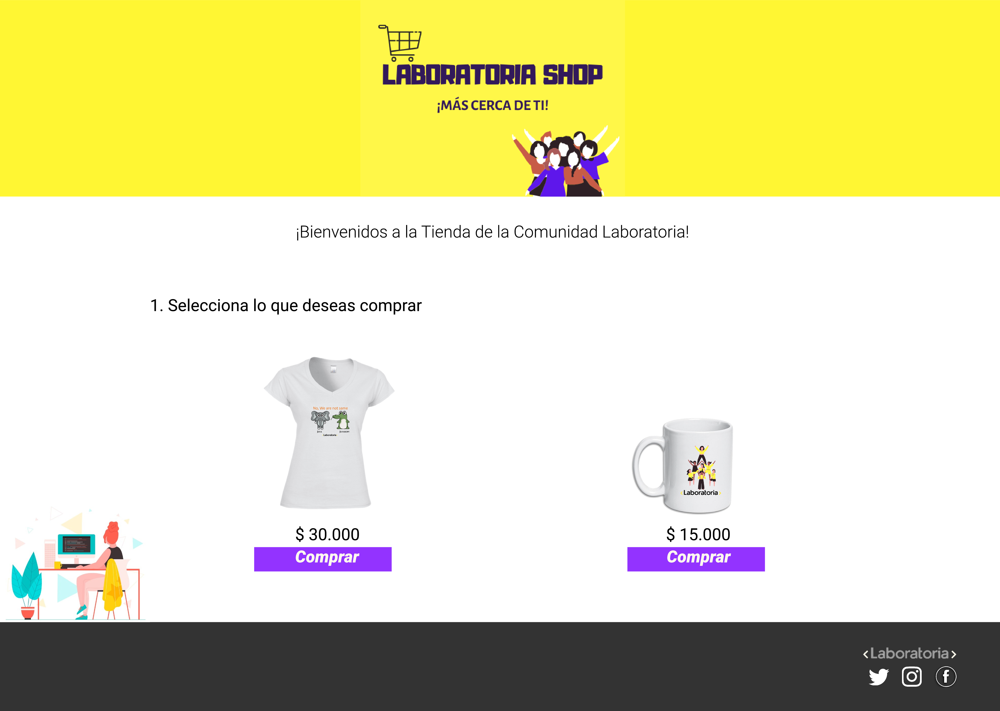
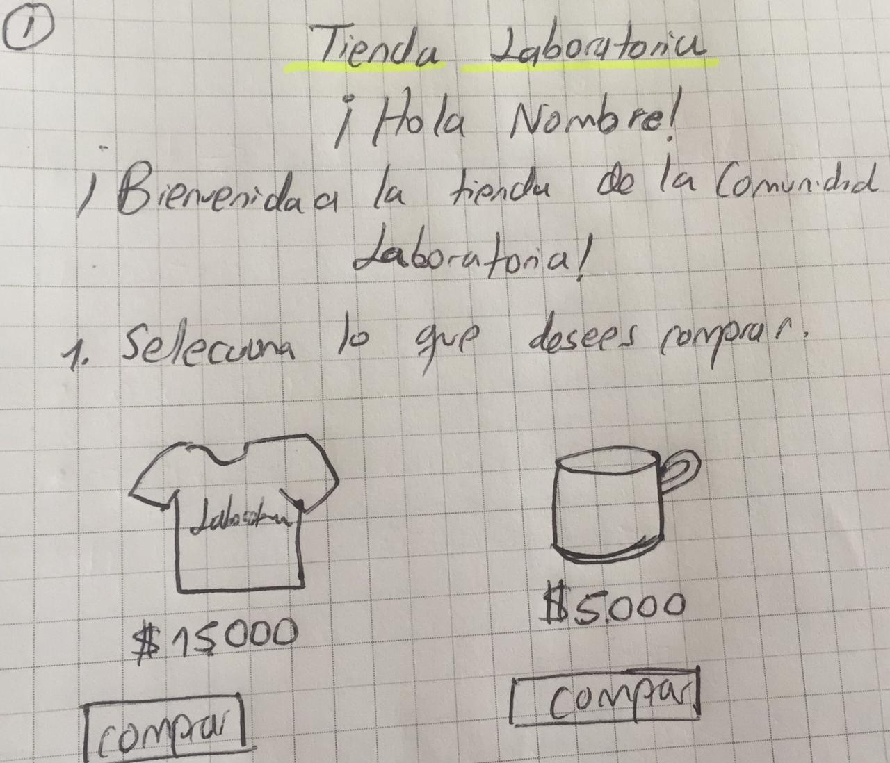
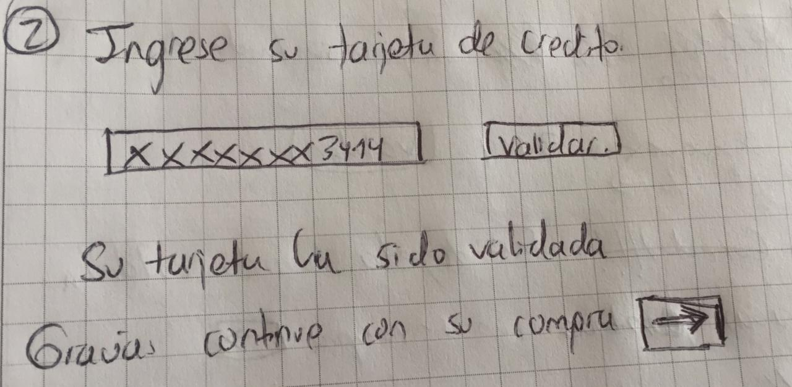
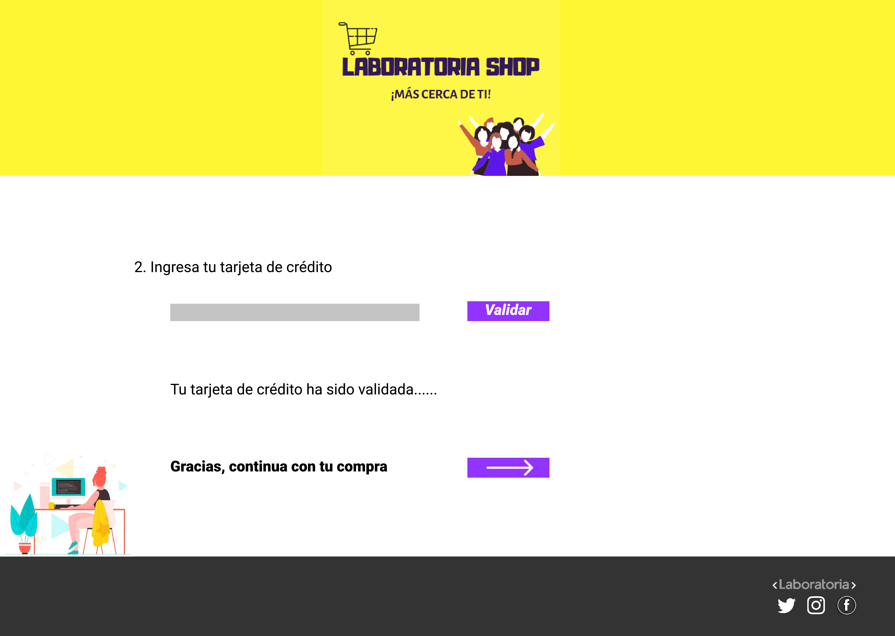

# LABORATORIA SHOP

La Tienda de la Comunidad Laboratoria ofrece productos únicos y de calidad, para que te sientas más identificado(a) con nosotros. Esta idea surgió de la primera promoción de Laboratoria (Bogotá). Apóyanos para que siga creciendo más nuestra comunidad alrededor del mundo.

***

## INVESTIGACIÓN UX

### Quienes son los principales usuarios del producto
Las personas entusiastas del mundo tecnológico, que consumen productos hechos por empresas y organizaciones inclusivas, que no distinguen género, creencias o preferencias. Laboratoria Shop es para todos.

### Cuáles son los objetivos de estos usuarios en relación con nuestro producto
Estas personas quieren usar productos divertidos que les permitan identificarse con los valores de Laboratoria: la innovación, el mejoramiento continuo, la inclusión, el trabajo en equipo, las capacidades de todos para aprender y aportar desde su diversidad, y las causas nobles que ayuden a construir un mundo mejor para todos.

### Cómo creemos que el producto que estamos creando está resolviendo problemas de nuestros usuarios
Estamos poniendo al alcance de la gente, la posibilidad de tener contacto con el mundo tech, bien sea como actores principales (coders, developers), o bien como lovers del mundo tech, al adquirir prendas modernas, frescas, identificadas con causas nobles, con nuevas formas de relacionarnos, feminismo, libertad. Todos esos valores son representados por nuestra marca.

## Prototipo de baja fidelidad

## Resumen feedback

Recibimos el feedback de varias compañeras, las cuales nos dijeron que les gusto el color, el logo que realizamos en Canvas, y el prototipo de alta fidelidad que realizamos en Figma, dijeron que la pagina era sencilla pero que los productos eran innovadores, que les gustaria comprar alguno de estos, igualmente a los coach les gusto. Como mejoras nos recomendaron el tamaño de los productos, además de permitir ocultar o mostrar las secciones para que se viera similar al prototipo.

## Prototipo de alta fidelidad

# OBJETIVOS DE APRENDIZAJE ALCANZADOS

### UX

 Diseñar la aplicación pensando y entendiendo al usuario.
 
 Crear prototipos para obtener feedback e iterar.
 

### HTML y CSS

 Uso correcto de HTML semántico.
 
 Uso de selectores de CSS.
 
 Construir tu aplicación respetando el diseño realizado (maquetación).
 
 
### DOM
 
 Manejo de eventos del DOM.

### Javascript

 Manipulación de strings.
 
 Uso de condicionales.
 
 Uso de bucles.
 
 Uso de funciones.
 
 
### Git y GitHub

 Comandos de git (add | commit | push).
 
 Manejo de repositorios de GitHub (clone | fork ).
 
 
### Buenas prácticas de desarrollo
 
 Uso de identificadores descriptivos (Nomenclatura | Semántica).
 

